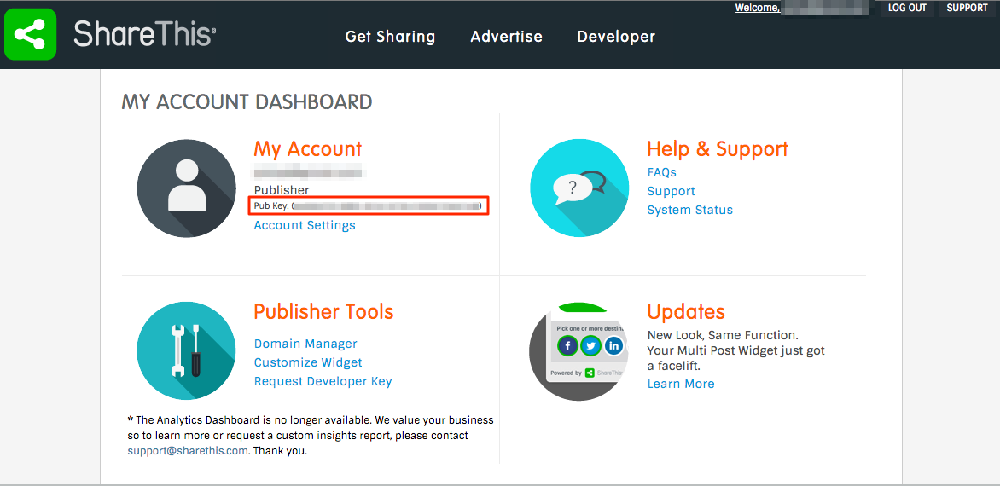

## ShareThis plugin for b2evolution

Using this plugin you can display the ShareThis widget into the contents of your site and let your visitors share them to their preferred social networks and websites.

### Installation

You can use this plugin in your site by following the regular plugins installation process detailed in this manual page: [Plugins available for installation](http://b2evolution.net/man/plugins-available-for-installation).

After having successfully installed the plugin in your site, you need to configure a **ShareThis** account in order to get a `Pub Key`, which is a code with the following format: XXXXXXXX-XXXX-XXXX-XXXX-XXXXXXXXXXXX.

1. Go to the [ShareThis website](http://www.sharethis.com/) and register a new user account (if you have not done it yet) and login into the site.
2. Go to [My Account Dashboard - http://www.sharethis.com/account/](http://www.sharethis.com/account/) and copy the `Pub Key` 
3. Go back to your b2evolution site and open the plugins settings page of the collection in which you want to display the ShareThis widget: [Plugin Settings](http://b2evolution.net/man/blog-plugin-settings)
4. Enable the plugin for that collection and paste the `Pub Key` code. 

As this is a **Text Renderer plugin**, you may control when to enable / disable it for individual posts by checking the **ShareThis** option in the **Text Renderers** panel of the posts' edition form. 

**NOTE:** some sections of this plugin have been developed based on the work published by Larry Nieves (http://cronicaslinuxeras.com/extension-sharethis-b2evolution#p2103-in-english)